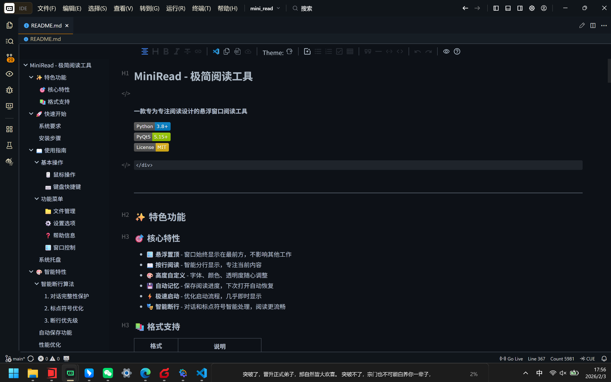

# MiniRead - 极简阅读工具

<div align="center">

**一款专为专注阅读设计的悬浮窗口阅读工具**

[](https://www.python.org/)
[](https://www.riverbankcomputing.com/software/pyqt/)
[](LICENSE)

[📥 下载 EXE](#-下载使用) | [📖 使用指南](#-使用指南) | [🛠️ 开发文档](#️-技术架构)



</div>

---

## 📥 下载使用

### 方式一：直接下载 EXE（推荐）

**无需安装 Python 环境，开箱即用！**

**[⬇️ 点击下载 MiniRead v1.0.1](https://github.com/hellobigbug/miniread/releases/download/v1.0.1/MiniRead-v1.0.1-windows-x64.exe)**

下载后：

1. 双击运行即可使用
2. 首次运行可能需要几秒钟解压

> 💡 **提示**: 部分杀毒软件可能误报，请添加信任。文件大小约 40 MB。

### 方式二：从源码运行

需要 Python 3.8+ 环境：

```bash
# 1. 克隆项目
git clone https://github.com/yourusername/mini_read.git
cd mini_read

# 2. 安装依赖
pip install -r requirements.txt

# 3. 运行程序
python main.py
# 或双击 run.bat
```

---

## ✨ 特色功能

### 🎯 核心特性

- ** 悬浮置顶**  - 窗口始终显示在最前方，不影响其他工作
- ** 按行阅读**  - 智能分行显示，专注当前内容
- ** 高度自定义**  - 字体、颜色、透明度随心调整
- ** 自动记忆**  - 保存阅读进度，下次打开自动恢复
- ** 极速启动**  - 优化启动流程，几乎即时显示
- ** 智能断行**  - 对话和标点符号智能处理，阅读更流畅

### 📚 格式支持

| 格式           | 说明                     |
| -------------- | ------------------------ |
| **TXT**  | 纯文本文件，自动检测编码 |
| **EPUB** | 电子书格式               |

---

## 📖 使用指南

### 基本操作

#### 🖱️ 鼠标操作

| 操作               | 功能         |
| ------------------ | ------------ |
| **滚轮**     | 上下翻页     |
| **左键拖拽** | 移动窗口位置 |
| **边缘拖拽** | 调整窗口大小 |
| **右键**     | 打开功能菜单 |

#### ⌨️ 键盘操作

| 快捷键                                | 功能                 |
| ------------------------------------- | -------------------- |
| `空格` / `回车` / `↓` / `→` | 下一行               |
| `↑` / `←` / `Backspace`       | 上一行               |
| `Home`                              | 跳转到首行           |
| `End`                               | 跳转到末行           |
| `PageUp`                            | 快速向上翻页（-10%） |
| `PageDown`                          | 快速向下翻页（+10%） |

### 功能菜单

右键点击窗口打开功能菜单：

#### 📁 文件管理

- **打开文件** - 选择要阅读的文件
- **最近文件** - 快速打开最近阅读的5个文件
- **阅读目录** - 查看所有阅读历史和进度

#### ⚙️ 设置选项

- **字体设置** - 自定义字体、大小、样式和颜色
- **字体大小** - 快速选择预设字号（极小/小/中等/大/特大）
- **显示设置** - 调整背景色和透明度

#### ❓ 帮助信息

- **操作说明** - 查看键盘和鼠标操作指南

#### 🪟 窗口控制

- **隐藏窗口** - 隐藏到系统托盘
- **退出程序** - 关闭应用

### 系统托盘

程序运行时会在系统托盘显示图标：

- **双击图标** - 快速显示/隐藏窗口
- **右键菜单** - 显示/隐藏、打开文件、退出程序

---

## 🎨 智能特性

### 智能断行算法

MiniRead 采用先进的智能断行算法，提供更好的阅读体验：

#### 1. 对话完整性保护

- 自动识别双引号（`""`、`""`）内的对话内容
- 尽量将完整对话保持在同一行显示
- 避免对话被截断影响阅读流畅度

#### 2. 标点符号优化

- 句子结束符（。！？）尽量不单独成行
- 自动将标点符号附加到前一句内容
- 允许适当超出显示宽度以保持完整性

#### 3. 断行优先级

1. **最高优先级** - 包含下一个句子结束符
2. **次高优先级** - 保持双引号对话完整
3. 在句子结束符后断行
4. 在逗号、顿号等停顿符后断行
5. 在其他标点符号后断行
6. 在空格处断行

### 自动保存功能

- ✅ 窗口位置和大小
- ✅ 字体偏好设置
- ✅ 背景色和透明度
- ✅ 阅读进度（每翻页10次自动保存）
- ✅ 最近打开的文件列表

### 性能优化

- **极速启动** - 移除启动画面，延迟加载非关键组件
- **懒加载模式** - 大文件加载几乎无延迟
- **智能缓存** - 位置历史缓存，快速回退
- **低资源占用** - CPU < 5%，内存 < 50MB

---

## 📂 配置文件

配置文件自动保存在用户目录：

```
C:\Users\<用户名>\.miniread\config.json
```

### 配置项说明

```json
{
  "window": {
    "x": 100,              // 窗口X坐标
    "y": 100,              // 窗口Y坐标
    "width": 800,          // 窗口宽度
    "height": 60,          // 窗口高度
    "opacity": 0.95        // 透明度 (0-1)
  },
  "font": {
    "family": "Microsoft YaHei",  // 字体名称
    "size": 16,                   // 字号
    "bold": false,                // 粗体
    "italic": false,              // 斜体
    "color": "#FFFFFF"            // 文字颜色
  },
  "display": {
    "background_color": "#2D2D2D",  // 背景颜色
    "border_radius": 8              // 圆角半径
  },
  "app": {
    "first_launch": false  // 是否首次启动
  },
  "last_position": {
    "file": "path/to/file.txt",  // 上次打开的文件
    "position": 1234              // 阅读位置（字符索引）
  },
  "reading_history": {
    "path/to/file.txt": {
      "position": 1234,           // 阅读位置
      "last_read": 1234567890,    // 最后阅读时间戳
      "progress": 0.45            // 阅读进度（0-1）
    }
  }
}
```

---

## 🔧 常见问题

### Q: 程序无法启动？

**A**: 请检查：

1. 如使用 EXE 版本，尝试以管理员权限运行
2. 如从源码运行，确保 Python 版本 >= 3.8
3. 确保已正确安装依赖：`pip install -r requirements.txt`

### Q: 文件显示乱码？

**A**:

- 程序会自动检测文件编码（UTF-8、GBK、GB2312等）
- 如仍有问题，建议将文件转换为 UTF-8 编码

### Q: PDF 文件内容提取不完整？

**A**:

- 扫描版 PDF 无法提取文本，请使用文字版 PDF
- 部分加密或特殊格式的 PDF 可能无法正确解析

### Q: 如何重置所有设置？

**A**: 删除配置文件夹：

```bash
rmdir /s "%USERPROFILE%\.miniread"
```

### Q: 窗口自动隐藏了？

**A**:

- 2分钟无操作会自动隐藏窗口
- 双击系统托盘图标可重新显示

### Q: 杀毒软件报毒？

**A**:

- PyInstaller 打包的程序可能被误报
- 请添加到杀毒软件白名单
- 或从源码运行程序

---

## 🛠️ 技术架构

### 核心技术栈

- **GUI框架**: PyQt5
- **文件解析**:
  - PDF: PyPDF2
  - DOCX: python-docx
  - EPUB: ebooklib
  - HTML: BeautifulSoup4
- **打包工具**: PyInstaller
- **配置管理**: JSON

### 项目结构

```
mini_read/
├── dist/
│   └── MiniRead.exe         # 打包的可执行文件
├── main.py                  # 主程序入口
├── main_window.py           # 主窗口实现
├── scrolling_text.py        # 文本显示组件
├── dialogs.py               # 对话框组件
├── config.py                # 配置管理
├── file_parser.py           # 文件解析器
├── constants.py             # 常量定义
├── styles.py                # 样式表定义
├── requirements.txt         # 依赖列表
├── run.bat                  # Windows启动脚本
├── MiniRead.spec            # PyInstaller 配置
├── icon.ico                 # 应用图标
├── logo.png                 # Logo图片
└── README.md                # 本文档
```

### 打包说明

如需重新打包 EXE，请参考 [`BUILD.md`](BUILD.md) 文档。

---

## 📝 更新日志

### v1.1.0 (2026-02-03)

**新增功能：**

- ✨ 智能断行算法 - 对话和标点符号优化
- ⚡ 极速启动 - 移除启动画面，优化加载流程
- 📖 阅读目录 - 查看所有阅读历史
- 📦 EXE 打包 - 提供独立可执行文件

**优化改进：**

- 🚀 启动速度提升 500ms+
- 🎯 双引号对话尽量保持在同一行
- 📌 句子结束符（。！？）不单独成行
- 💾 阅读进度保存优化（每10次翻页保存一次）

**Bug修复：**

- 🐛 修复语法错误导致的启动失败

### v1.3.0 (2026-02-03)

**新增功能：**

- 📦 配置批量更新 - 减少IO次数
- 💾 文件解析缓存 - 大文件重新打开更快
- ⏰ 自动保存定时器 - 30秒自动保存阅读位置
- 🧠 智能自动隐藏 - 鼠标在窗口内时不隐藏，全屏模式延长隐藏时间
- 🔍 Ctrl+滚轮缩放字体 - 快速调节字体大小
- 🎨 文件拖拽视觉反馈 - 拖拽时窗口显示蓝色边框
- 📋 托盘菜单最近文件 - 右键托盘快速打开最近文件
- 📁 常量集中管理 - 所有常量统一到constants.py
- 🎨 样式表分离 - QSS样式集中到styles.py

### v1.2.0 (2026-02-03)

- 🔥 移除全局快捷键，简化代码结构
- 🗑️ 删除未使用的模块文件
- 📦 减小打包体积

### v1.0.0 (2024-01)

- 🎉 初始版本发布
- 🪟 悬浮置顶窗口
- 📖 按行文本显示
- 📁 多格式文件支持
- 🎨 字体自定义功能
- 💾 配置自动保存

---

## 🤝 贡献指南

欢迎提交 Issue 和 Pull Request！

### 开发环境设置

1. Fork 本仓库
2. 创建特性分支：`git checkout -b feature/AmazingFeature`
3. 提交更改：`git commit -m 'Add some AmazingFeature'`
4. 推送到分支：`git push origin feature/AmazingFeature`
5. 提交 Pull Request

---

## 📄 许可证

本项目采用 MIT 许可证 - 详见 [LICENSE](LICENSE) 文件

---

## 💖 致谢

感谢所有为这个项目做出贡献的开发者！

---

<div align="center">

**MiniRead - 让阅读更专注** 📚

如果这个项目对你有帮助，请给一个 ⭐ Star！

</div>
